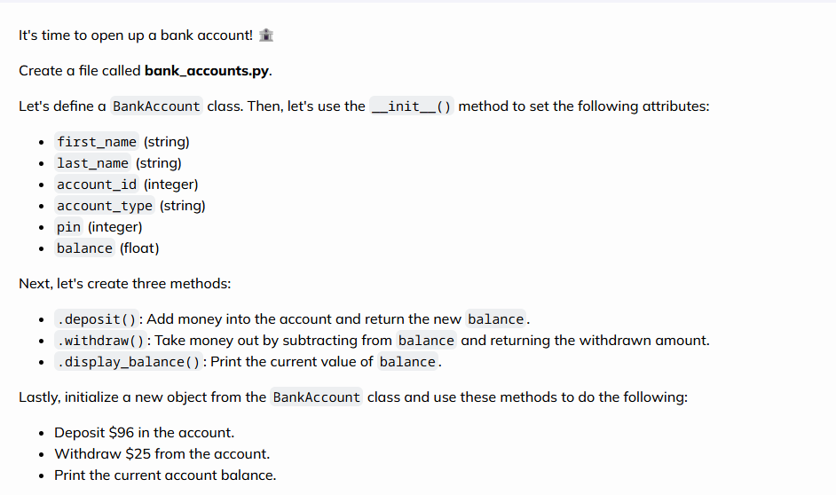

# Bank_Accounts

## Overview
### This is a mini-project I have completed using the Codedex specific. I have decided to take the initial task specification and add extra features such as:

* Menu option.
* View, deposit and withdraw function.
* A PIN verification for withdrawals.
* Messages for the user to create a banking app like experience.

### Here's what the original specification looked like:

## Tools Used
[Codedex](https://www.codedex.io) - Project specification.
#### ChatGPT - Used to check for troubleshooting code and generating comments.
[Bro Code](https://www.youtube.com/watch?v=8aW3tkIul-8&ab_channel=BroCode) - This channel was one of the first results that appeared when researching for code inspiration.

[GeeksforGeeks](https://www.geeksforgeeks.org/python-program-to-create-bankaccount-class-with-deposit-withdraw-function/) - Used for coding inspiration.
#### GitHub - Host code and ReadMe file.
#### VS Code - Create code and ReadMe file.

## Future Improvements
* Create a front-end.
* Use a database to store bank account information.
